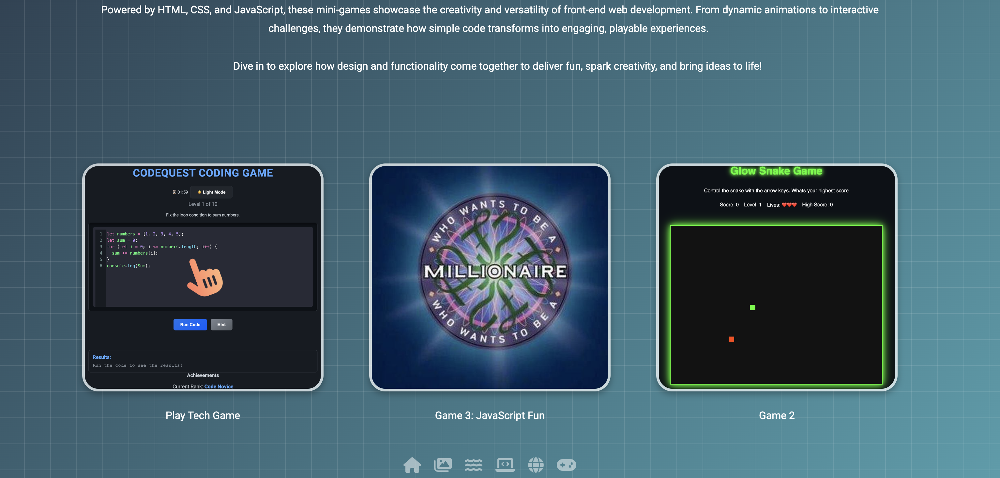

# **Portfolio - Showcasing My Skills and Projects**

Welcome to my portfolio repository! This project serves as a demonstration of my technical abilities, creativity, and personal journey in the tech industry. The portfolio is designed to showcase my projects, skills, services, and experiences, along with interactive features such as animations, a 3D globe, mini-games, and more. Below, you’ll find all the details about the project, including the structure, features, and technologies used.

---

## **Table of Contents**

1. [Introduction](#introduction)  
2. [Features](#features)  
3. [Technologies Used](#technologies-used)  
4. [File Structure](#file-structure)  
5. [Installation and Setup](#installation-and-setup)  
6. [Usage](#usage)  
7. [Screenshots and Visual Highlights](#screenshots-and-visual-highlights)  
8. [Skills Demonstrated](#skills-demonstrated)  
9. [Future Improvements](#future-improvements)  
10. [Contact Details](#contact-details)  
11. [License](#license)

---

## **Introduction**

This repository contains a **static portfolio website** designed to present my skills, projects, services, and personal journey in the tech industry. It reflects my commitment to delivering visually appealing and interactive web solutions while also sharing insights into my development path.

The site is fully responsive, intuitive, and optimised for performance, making it accessible across various devices and screen sizes.

---

## **Features**

- **Main Page Navigation (Scroll Navbar)**  
  A scroll-based navigation bar located at the top of the main page. As users interact with the links, the page scrolls smoothly to the corresponding sections (e.g., About, Skills, Projects). This ensures quick and intuitive access to all key sections without leaving the page. also include the dark/light mode Toggle

  

- **Dark Mode**  
  Includes a toggle option for users to switch between dark and light modes, enhancing usability and catering to personal preferences.

  

- **Skills Section**  
  Highlights my technical expertise, including programming languages, frameworks, tools, and technologies I’ve mastered, all presented in an organised and visually appealing way.
 
  

- **Projects Section**  
  Showcases a curated selection of my past projects, complete with detailed descriptions, the technology stacks used, and links to live demos or repositories for easy access.

  
  
- **Credentials and Resume Section**  
  Offers direct access to my resume and professional credentials, such as certifications and achievements, ensuring transparency and credibility.

  

- **Blog Section**  
  A platform where I share my technical insights, thoughts, and lessons learned throughout my journey in the tech industry, offering valuable perspectives.

  

- **Interactive Animations**  
  Features a flying bee animation that adds a playful and interactive touch to the website, guiding users to a hidden **Secret Page**.
- **Bee Toggle**  
  Allows users to toggle the flying bee animation on or off for a customisable browsing experience.

  

- **Services Section**  
  Outlines the professional services I provide, including web development, consulting, and bespoke solutions tailored to client needs.

  

- **Footer Section**  
  Includes contact details, a link to download my CV, and social media links.

  

- **Secret Page**  
  A hidden section accessed through the flying bee animation, offering a more personal and interactive experience with the following features:  
  
- **Animated Welcome Page**: A 3D swiper gallery showcasing a collection of images and visuals with smooth transitions and engaging effects. 
  
  

  - **Secret Page Navigation (Icon Navbar)**  
  A fixed icon-based navigation bar that remains visible as users scroll through the secret page. Each icon represents a specific section (e.g., Gallery, Mini-Games, 3D Globe) and allows users to navigate seamlessly to the desired section while staying oriented. The persistent visibility ensures a fluid and interactive browsing experience.

      

- **Interactive Gallery**: A 3D swiper gallery showcasing a collection of images and visuals with smooth transitions and engaging effects. 

   

-  **Interactive 3D Globe**: Powered by the **Cesium API**, this globe dynamically showcases my travel journey, highlighting locations I’ve visited or 
  explored.
  
   

- **Mini-Games**: Interactive and fun games created entirely by me, providing entertainment and demonstrating my creativity. 

  

  - **Additional Projects**: A showcase of more projects that didn’t make it to the main portfolio section, offering further insights into my work.  

  - **Tech Journey**: A personal narrative detailing my growth and experiences in the tech world, giving visitors a deeper understanding of my background and aspirations.

- **Responsive Design**  
  The entire website is fully optimised for all devices, including desktops, tablets, and mobile phones, ensuring a seamless and engaging experience regardless of screen size.

---

## **Technologies Used**

This project leverages the following technologies:

- ****: Used to structure the content semantically.  
- ****: Responsible for styling and creating responsive layouts using modern techniques like Flexbox and Grid.  
- ****: For interactive elements and dynamic behaviour across the site.  
- ****: Integrated to render an interactive and visually appealing 3D globe.  
- ****: Used for managing animation data (e.g., the flying bee animation) and other structured content.  
- ****: Provides professional icons for enhancing the UI/UX.  
- ****: Ensures modern and polished typography throughout the site.  
- ****: Includes videos, images, and favicons to create a rich multimedia experience.

---

## **File Structure**

The repository is organised as follows:

- **`index.html`**: The homepage, featuring the main portfolio sections like Projects, Blog, Skills, and Services.  
- **`secret-page.html`**: A hidden page that can be accessed via the flying bee animation, featuring the gallery, mini-games, 3D map, and more.  
- **`assets/animation/`**: Contains JSON files like `just-a-bee.json` used for animations.  
- **`assets/css/`**: Includes all the stylesheets for the website, such as:  
  - `bee-animation.css`  
  - `secret-page.css`  
  - `style.css`  
- **`assets/cv/`**: Contains the resume file:  
  - `WalidWillWhiteF-sCV.pdf`  
- **`assets/data/`**: Stores structured data files, such as:  
  - `countries.geojson`  
- **`assets/favicon/`**: Contains the favicon and related assets.  
- **`assets/images/`**: Stores all image files used across the website.  
- **`assets/videos/`**: Contains video files, including:  
  - `whale.MP4`  
- **`js/`**: Contains JavaScript files for interactivity and animations, including:  
  - `bee-animation.js`  
  - `script.js`  
  - `scuba.js`  
  - `secret.js`  
  - `travel-map.js`  
- **`ReadmePics/`**: Contains images for the README documentation, such as:  
  - `Filestructure.png`  

