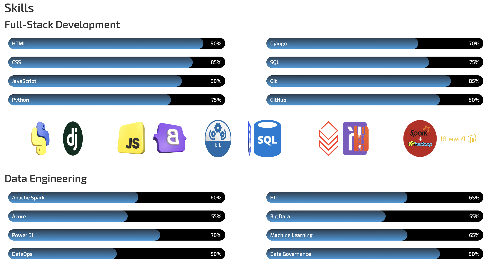
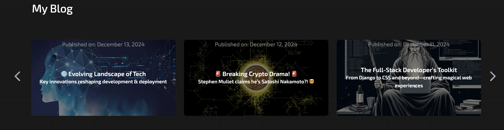
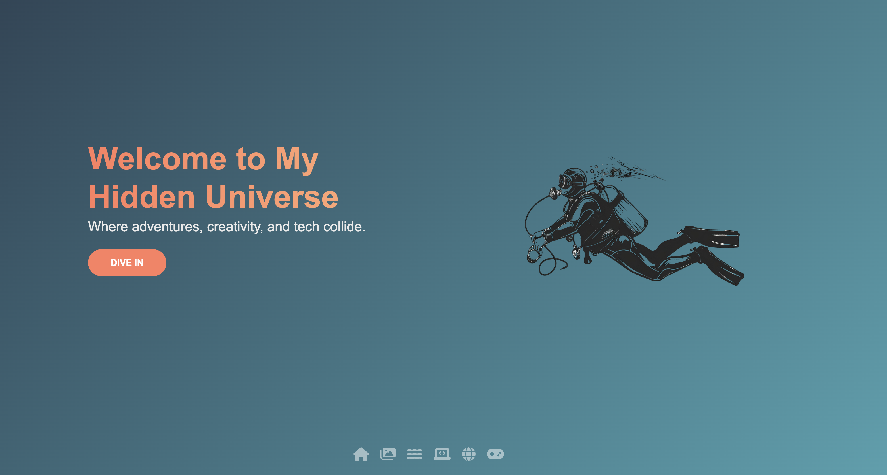
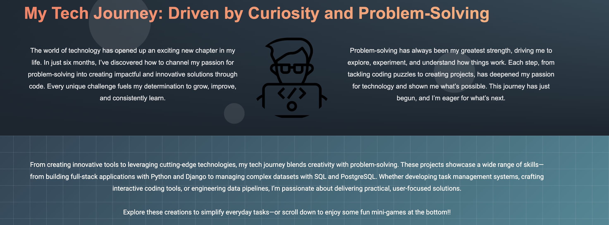
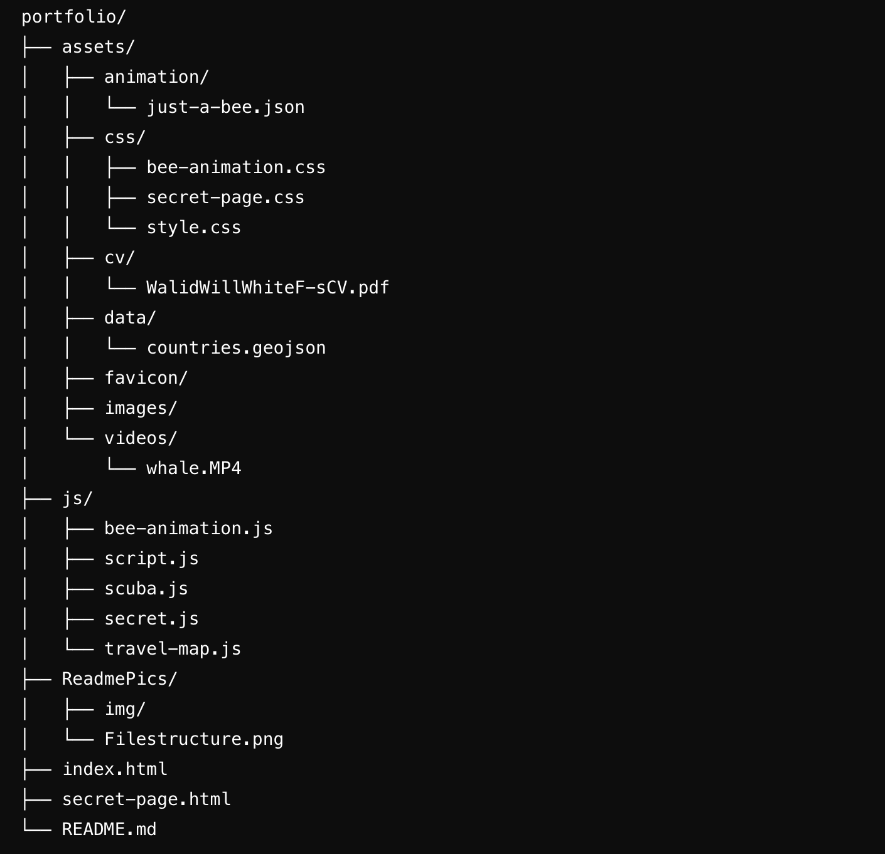

# **Portfolio - Showcasing My Skills and Projects** 🚀✨

Welcome to my portfolio repository! 🎉 This project is a demonstration of my technical abilities, creativity, and personal journey in the tech industry. It features interactive animations, a 3D globe 🌍, mini-games 🎮, and more to showcase my projects, skills, and services in an engaging and professional way.

---

## 📑 **Table of Contents**

1. [Introduction](#introduction)  
2. [Wireframes](#wireframes)  
3. [Features](#features)  
   - [Responsive Design](#responsive-design)  
4. [Technologies Used](#technologies-used)  
5. [Tools & Libraries](#tools--libraries)  
6. [File Structure](#file-structure)  
7. [Installation and Setup](#installation-and-setup)  
8. [Usage](#usage)  
9. [Screenshots and Visual Highlights](#screenshots-and-visual-highlights)  
10. [Skills Demonstrated](#skills-demonstrated)  
11. [Future Improvements](#future-improvements)  
12. [🤝 Connect with Me](#connect-with-me)  
13. [📜 License](#license)

---

## 🖋️ **Introduction** ✨

Welcome to my portfolio repository! 🎉 This project is more than just a showcase of my work—it's a carefully designed platform that reflects my journey, skills, and passion for technology. Whether you're a prospective employer, collaborator, or just curious about my work, this portfolio aims to provide an engaging and comprehensive insight into my abilities and creative vision.

The website is a **static portfolio** that combines clean design, interactivity, and functionality to demonstrate my technical expertise and personal achievements. From the **responsive layouts** that adapt seamlessly to any device to the **interactive animations** and **mini-games** that showcase my creativity, this portfolio is built with the goal of leaving a lasting impression.

---

### **🏆 Key Features** 🚀  
  
  
  
  
  
  

---

### **🎯 Purpose of the Portfolio** 🎨 
This portfolio is designed to:
- **Present My Work**: Showcase my skills, projects, and professional achievements in an organised and visually appealing way.
- **Demonstrate Technical Proficiency**: Highlight my ability to work with modern web development tools, frameworks, and technologies.
- **Engage Users**: Offer interactive features like animations, a 3D globe, and fun mini-games to make the experience memorable.
- **Tell My Story**: Share my personal and professional journey, including how I’ve grown and evolved as a developer.

---

### **👥 Who Is This Portfolio For?** 🧐 
- **Employers and Recruiters**: Gain insight into my technical expertise, creativity, and the scope of my skills.  
- **Collaborators**: Explore my approach to projects and see how I can contribute to a team or partnership.  
- **Learners and Enthusiasts**: Find inspiration from the tools, techniques, and technologies I’ve used in this project.

---

### **✨ Key Highlights** 🌟  
- Fully **responsive design** for an optimal user experience across all devices.  
- A carefully crafted **Secret Page**, featuring interactive mini-games, a 3D globe powered by the **Cesium API**, and a personal narrative of my tech journey.  
- Sections dedicated to my **skills**, **projects**, **services**, and **credentials**, offering a holistic view of my professional background.  
- Fun and creative touches, such as a **flying bee animation** that guides users to hidden features, as well as toggle options for dark/light mode and animations.

---

This portfolio is not just a demonstration of my technical skills—it's a testament to my creativity, problem-solving abilities, and commitment to crafting high-quality, engaging web experiences. I hope you enjoy exploring it as much as I enjoyed building it.

---

## 🧩 **Wireframes**

Before development began, I carefully designed wireframes to ensure a clear, user-friendly layout. The wireframes guided the structure of the site and provided a solid foundation for creating a seamless user experience.

---

## ✨ **Features**

### 🔗 **Main Page Navigation (Scroll Navbar)**  
A scroll-based navigation bar located at the top of the main page. As users interact with the links, the page scrolls smoothly to the corresponding sections (e.g., About, Skills, Projects). It also includes a dark/light mode toggle for customisation.

### 🌗 **Dark Mode**  
A toggle option for users to switch between dark and light modes, enhancing usability and catering to personal preferences.

### 💻 **Skills Section**  
Highlights my technical expertise, including programming languages, frameworks, tools, and technologies I’ve mastered, all presented in an organised and visually appealing way.

### 📂 **Projects Section**  
Showcases a curated selection of my past projects, complete with detailed descriptions, the technology stacks used, and links to live demos or repositories for easy access.

### 📜 **Credentials and Resume Section**  
Provides direct access to my resume and professional credentials, such as certifications and achievements.

### ✍️ **Blog Section**  
A platform where I share technical insights, thoughts, and lessons learned throughout my journey in the tech industry.

### 🐝 **Interactive Animations**  
Features a flying bee animation that adds a playful and interactive touch to the website, guiding users to a hidden **Secret Page**.

### 🐝 **Bee Toggle**  
Allows users to toggle the flying bee animation on or off for a customisable browsing experience.

### 🛠️ **Services Section**  
Outlines the professional services I provide, including web development, consulting, and bespoke solutions tailored to client needs.

### 📋 **Footer Section**  
Includes contact details, a link to download my CV, and social media links.

---

## 🗺️ **Secret Page**

A hidden section accessed through the flying bee animation, offering a more personal and interactive experience.

### 🎨 **Animated Welcome Page**  
A 3D swiper gallery showcasing a collection of images and visuals with smooth transitions and engaging effects.

### 🔗 **Secret Page Navigation (Icon Navbar)**  
A fixed icon-based navigation bar that remains visible as users scroll through the secret page. Each icon represents a specific section (e.g., Gallery, Mini-Games, 3D Globe) and allows users to navigate seamlessly.

### 🖼️ **Interactive Gallery**  
A 3D swiper gallery showcasing images and visuals with engaging effects.

### 🌍 **Interactive 3D Globe**  
Powered by the **Cesium API**, this globe dynamically showcases my travel journey, highlighting locations I’ve visited or explored.

### 🎮 **Mini-Games**  
Interactive games created entirely by me, providing entertainment and showcasing creativity.

### 📂 **Additional Projects**  
A showcase of more projects that didn’t make it to the main portfolio section.

### 🚀 **Tech Journey**  
A personal narrative detailing my growth and experiences in the tech world.

---

## 🎯 **Responsive Design**

The website is built to deliver a seamless experience across all devices, ensuring it functions perfectly and looks stunning on desktops, tablets, and mobile phones.

- **🎯 Flexible Layouts**: Built with modern CSS techniques like Flexbox and Grid to adapt dynamically to different screen sizes.  
- **📱 Mobile-Friendly**: Touch-optimised navigation and interactive elements.  
- **🎨 Media Queries Magic**: Tailored styles ensure consistency across resolutions.  
- **📷 Scalable Visuals**: Images and UI components dynamically resize for every screen.

---

## 💻 **Technologies Used**

This project leverages the following technologies:

- ****: Used to structure the content semantically.  
- ****: For styling and creating responsive layouts.  
- ****: For interactive elements and dynamic behaviour.  
- ****: Used for managing animation and data.

---

## 🛠️ **Tools & Libraries**

- ****: For rendering the interactive 3D globe.  
- ****: For enhancing the UI with icons.  
- ****: Ensures clean typography.  
- ****: For multimedia elements like videos and images.

---

## 📂 **File Structure**

The repository is organised as follows:

- **`index.html`**: The homepage, featuring the main portfolio sections like Projects, Blog, Skills, and Services.  
- **`secret-page.html`**: A hidden page that can be accessed via the flying bee animation, featuring the gallery, mini-games, 3D map, and more.  
- **`assets/animation/`**: Contains JSON files like `just-a-bee.json` used for animations.  
- **`assets/css/`**: Includes all the stylesheets for the website, such as:  
  - `bee-animation.css`  
  - `secret-page.css`  
  - `style.css`  
- **`assets/cv/`**: Contains the resume file:  
  - `WalidWillWhiteF-sCV.pdf`  
- **`assets/data/`**: Stores structured data files, such as:  
  - `countries.geojson`  
- **`assets/favicon/`**: Contains the favicon and related assets.  
- **`assets/images/`**: Stores all image files used across the website.  
- **`assets/videos/`**: Contains video files, including:  
  - `whale.MP4`  
- **`js/`**: Contains JavaScript files for interactivity and animations, including:  
  - `bee-animation.js`  
  - `script.js`  
  - `scuba.js`  
  - `secret.js`  
  - `travel-map.js`  
- **`ReadmePics/`**: Contains images for the README documentation, such as:  
  - `Filestructure.png`  

## 🤠Connect with Me 

